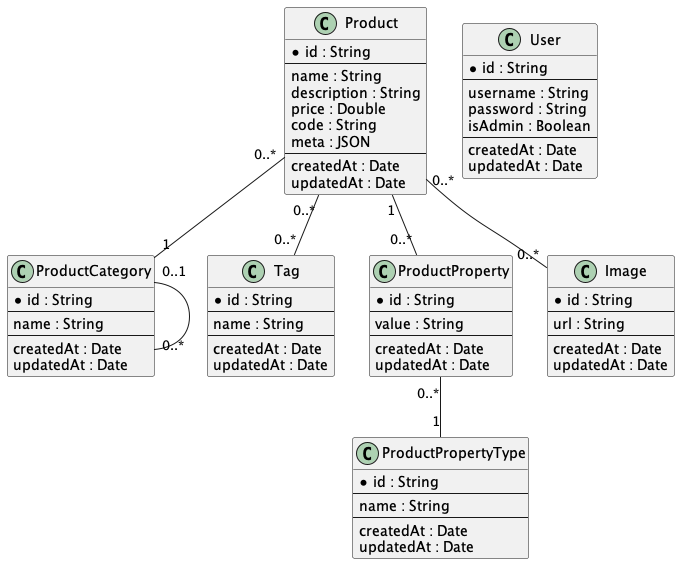

# KeystoneJS E-commerce

This is an e-commerce platform built using KeystoneJS. It is designed to be easily customizable and extendable to meet the needs of different e-commerce applications.

## How to Install

To use this library, you'll need to have Node.js and NPM (or Yarn) installed on your machine. You can install it using the following commands:

```shell
# Using NPM
npm install --save keystonejs-ecommerce

# Using Yarn
yarn add keystonejs-ecommerce
```

## Documentantion

This library is built on Keystonejs 6. Check the [docs](https://keystonejs.com/docs).

### Auth

Auth function with predefined options for using with User list.

#### withAuth

It calls `createAuth` from `@keyjstone/core` with these predefined options:

- listKey
- identityField
- secretField
- sessionData

```typescript
// keystone.ts

import { auth } from 'keystonejs-ecommerce';

export default auth.withAuth(
  config({
    db, // ...db config
    lists, // ...list config
    session, // ...session config
    // ...etc
  }),
);
```

#### createAuth

Overrides `createAuth` from `@keyjstone/core` with optional parameters with predefined options (see [withAuth](#withauth)).

```typescript
// keystone.ts

import { auth } from 'keystonejs-ecommerce';

export default auth
  .createAuth({
    initFirstItem: { fields: ['username', 'password', 'isAdmin'] },
  })
  .withAuth(
    config({
      db, // ...db config
      lists, // ...list config
      session, // ...session config
      // ...etc
    }),
  );
```

### Schema



To import list:

```typescript
// keystone.ts

import { auth, schema } from 'keystonejs-ecommerce';

export default auth.withAuth(
  config({
    // ...
    lists: {
      ...schema.lists,
      // ...your lists
    },
    // ...
  }),
);
```

## License

KeystoneJS E-commerce is open source and released under the [MIT License](./LICENSE).

This means that you can use, modify, and distribute the library for personal and commercial purposes as long as you include the license in your derivative work and give attribution to the original authors.

The license also comes with no warranty or liability, so use the library at your own risk. If you find a bug or issue, please feel free to [open an issue](https://github.com/vlnevyhosteny/keystonejs-ecommerce/issues) or submit a pull request to help improve the library for everyone.
